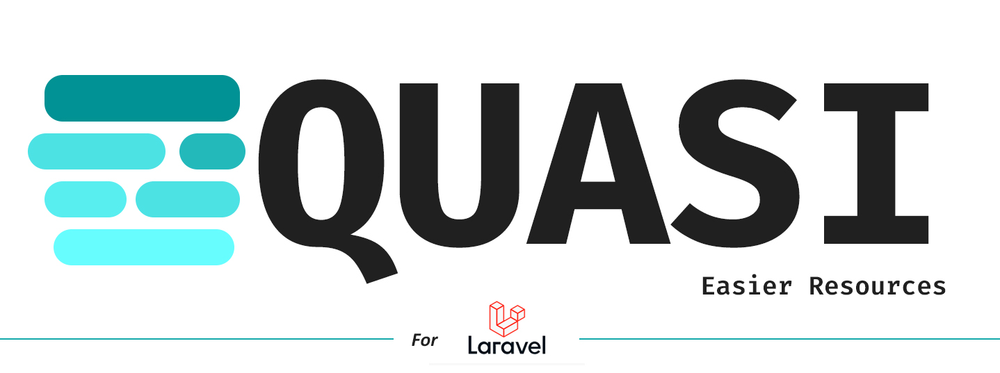

# Quasi

[](https://packagist.org/packages/protoqol/quasi)

Ever thought it was a bit tedious to define an API resource for a large table? This package makes life a bit
simpler by presetting all columns in a Resource, so you can simply remove the ones you don't need, instead of adding the
ones you need.

### Want to help keep open-source sustainable?

You can help by contributing to the code or donating using the button below!
Both are highly appreciated and contribute directly to keeping open-source free and sustainable!

[](https://www.paypal.com/cgi-bin/webscr?cmd=_s-xclick&hosted_button_id=TJS5BKNE3JGW8)

## Installation

You can install the package via composer:

```bash
composer require protoqol/quasi
```

Optional - Publish configuration file with:
```php 
php artisan vendor:publish --tag=quasi-config
```

## Usage

```php
//  Table name is "guessed" based of the resource name and will result in 'users' in this case.
php artisan make:qresource UserResource 

// Table name is given as the second argument.
php artisan make:qresource UserResource users
```

### Config

```php 
// The keys defined in this config will always be excluded from resources - if they exist as a key in the table.
'exclude' => [
    // 'id',
],
```

### Changelog

Please see [CHANGELOG](CHANGELOG.md) for more information what has changed recently.

## Credits

- [Quinten Justus](https://github.com/protoqol)
- [All Contributors](../../contributors)

## License

The GNU GPL (GPL). Please see [License File](LICENSE.md) for more information.
